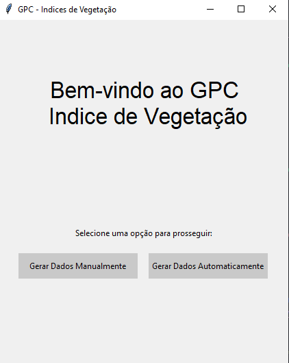
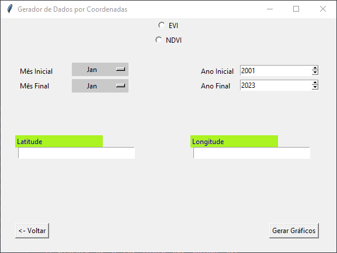
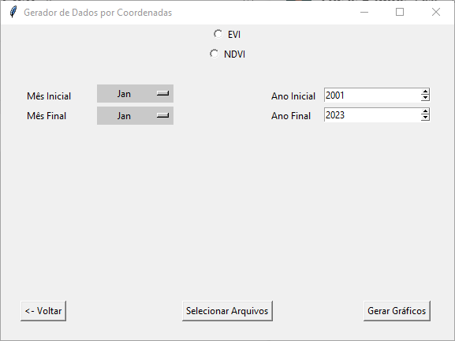

# GPC - Gráficos Por Coordenadas - _índice de Vegetação_ 

<!---Esses são exemplos. Veja https://shields.io para outras pessoas ou para personalizar este conjunto de escudos. Você pode querer incluir dependências, status do projeto e informações de licença aqui--->


> O GPC é um conjunto de projetos que visam a construção de gráficos de forma simples e dinâmica. No caso do GPC - Indíce de Vegetação, ele desenvolve gráficos referentes aos índices de vegetação (EVI e NDVI), a partir de um determinado período de tempo, em uma coordenada selecionada pelo usuario - seja manualmente ou através da leitura de um arquivo csv. 

## 🚀 Iniciando o GPC de Índice de Vegetação



Ao abrir o programa:
```
Escolher entre Gerar Gráficos Manualmente, ou Gerar Gráficos Automaticamente, a partir de um ou mais arquivos .csv
```

#### Gerar Gráficos Manualmente



- Ao clicar nessa opção, você entrará na tela de geração. 
- Será necessário então que você defina os parâmetros desejados, antes da geração do gráfico.
- Escolha qual índice deseja salvar, NDVI ou EVI
- Selecione o período de tempo desejado (lembrando que grandes periodos de tempo levam um tempo maior para serem processados).
- Digite as Coordenadas que deseja.
- Agora é só clicar em "*Gerar Gráficos*" e aguardar.

Será gerada uma pasta com o nome "lat {sua latitude} e lon {sua longitude}", e dentro dela você pode encontrar o gráfico correspondente à variável selecionada, no período temporal escolhido. Além do gráfico salvo no formato _.png_, também será gerado um arquivo .csv, contendo as mesmas informações do gráfico. 

#### Gerar Gráficos Automaticamente



- Ao clicar nessa opção, você entrará na tela de geração. 
- Será necessário então que você defina os parâmetros desejados, antes da geração do gráfico.
- Escolha qual índice deseja salvar, NDVI ou EVI
- Selecione o período de tempo desejado (lembrando que grandes periodos de tempo levam um tempo maior para serem processados).
- Clique no botão "Selecionar Arquivos", e escolha um arquivo .csv que contenha a estrutura ideal para leitura, isto é, as colunas Id, longitude e latitude.
- Agora é só clicar em "*Gerar Gráficos*" e aguardar.
 
Será gerada uma pasta com o nome do arquivo, e dentro dela você pode encontrar o(s) gráfico(s) correspondente(s) à(s) variável selecionada(), no período temporal escolhido. Os arquivos serão salvos com o nome "ID {id} - {variável escolhida}" e no formato _.png_. 

------------------------------------------------------------------------------------

## Contato

No caso de dúvidas, sugestões e críticas, basta entrar em contato com:
<table>
  <tr>
    <td align="center">
      <a href="#">
        <br>
        <sub>
          <h3>
            <b>Lucas Matheus</b>
          </h3>
        </sub>
      </a>
    </td>
    <td>
      <h3>
        📧 <a href=mailto:lucas.matheus@vegamonitoramento.com.br>  lucas.matheus </a>
      </h3>
      <h3>
        ☎ <a href="https://wa.me/+5581998176545">  +55 81 99817-6545 </a>  
      </h3>
    </td>
  </tr>
</table>

  
Para contribuir com <nome_do_projeto>, siga estas etapas:

1. Bifurque este repositório.
2. Crie um branch: `git checkout -b <nome_branch>`.
3. Faça suas alterações e confirme-as: `git commit -m '<mensagem_commit>'`
4. Envie para o branch original: `git push origin <nome_do_projeto> / <local>`
5. Crie a solicitação de pull.

Como alternativa, consulte a documentação do GitHub em [como criar uma solicitação pull](https://help.github.com/en/github/collaborating-with-issues-and-pull-requests/creating-a-pull-request).

## 🤝 Colaboradores

Agradecemos às seguintes pessoas que contribuíram para este projeto:

<table>
  <tr>
    <td align="center">
      <a href="#">
        <br>
        <sub>
          <b>Iuri Silva</b>
        </sub>
      </a>
    </td>
    <td align="center">
      <a href="#">
         Tio ZUck
        
        <br>
        <sub>
          <b>Mark Zuckerberg</b>
        </sub>
      </a>
    </td>
    <td align="center">
      <a href="#">
        <br>
        <sub>
          <b>Steve Jobs</b>
        </sub>
      </a>
    </td>
  </tr>
</table>


## 😄 Seja um dos contribuidores<br>

Quer fazer parte desse projeto? Clique [AQUI](CONTRIBUTING.md) e leia como contribuir.

## 📝 Licença

Esse projeto está sob licença. Veja o arquivo [LICENÇA](LICENSE.md) para mais detalhes.

[⬆ Voltar ao topo](#nome-do-projeto)<br>


### Ajustes e melhorias

O projeto ainda está em desenvolvimento e as próximas atualizações serão voltadas nas seguintes tarefas:

- [x] Tarefa 1
- [x] Tarefa 2
- [x] Tarefa 3
- [ ] Tarefa 4
- [ ] Tarefa 5
